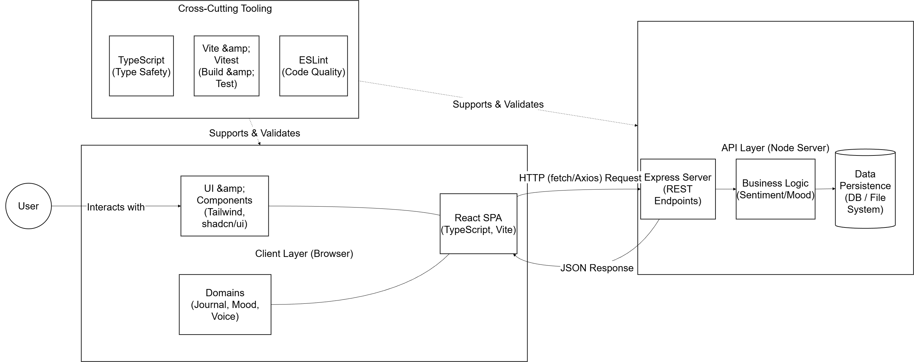
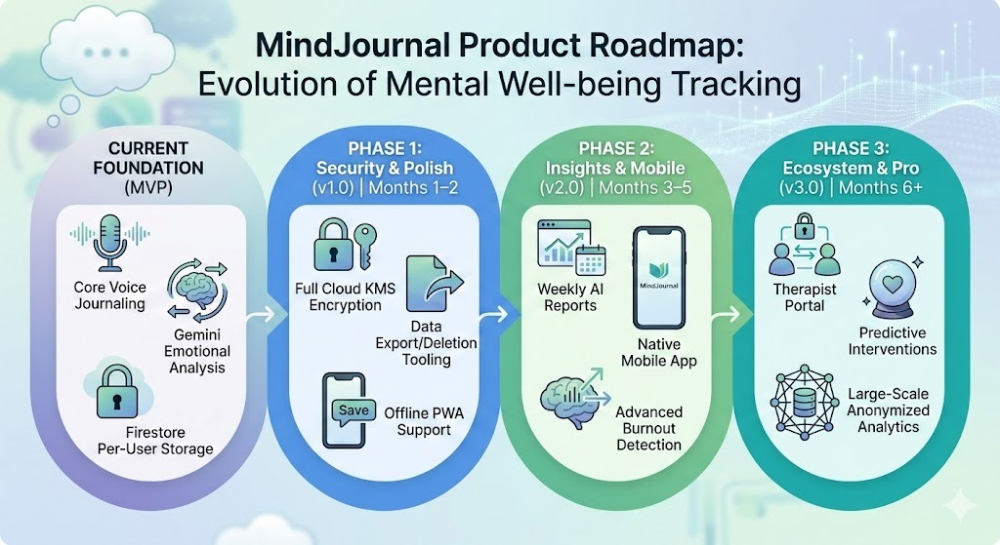

# MindJournal — AI Voice Journaling for Emotional Well-being

## 📌 Overview

The system converts voice to text using **Google Speech-to-Text** (supporting English, Malay, Mandarin, and Cantonese), analyzes emotional tone using **Google Gemini**, generates personalized supportive advice, and visualizes emotional trends over time through dynamic mood graphs.

By combining voice interaction, AI-powered emotional analysis, and secure cloud storage, MindJournal helps users build emotional awareness and monitor their mental well-being consistently.

---

## 🎯 Problem Statement

Many individuals struggle to consistently monitor their mental health. Emotional patterns often go unnoticed until burnout, anxiety, or severe stress occurs. Traditional journaling lacks structured emotional insights and long-term trend visualization.

MindJournal transforms unstructured voice reflections into meaningful emotional insights using AI-powered analysis and visualization.

---

## 🌍 SDG Alignment

**SDG 3 — Good Health & Well-being**

MindJournal promotes proactive emotional awareness, early stress detection, and consistent self-reflection to support mental well-being.

---

## ✨ Key Features

- 🎤 Real-time voice journaling
- 🌏 Multilingual voice support (English, Malay, Mandarin, Cantonese)
- 📝 Google Speech-to-Text transcription
- 🤖 AI-powered emotional analysis using Google Gemini
- 📊 Sentiment scoring in percentage (%)
- 🧠 Dominant emotion detection (e.g., Distress, Calm, Positive, Anxious)
- 💬 AI-generated personalized emotional advice
- 📈 Dynamic mood trend visualization
- ☁️ Secure journal storage using Cloud Firestore
- 🔐 Architecture designed for encrypted storage (Cloud KMS-ready)

---

## ⚙️ Implementation Details
🤖 AI Integration (Google Gemini)

Google Gemini is used to:

- Analyze emotional tone of journal entries
- Generate structured sentiment score
- Identify dominant emotional state
- Produce AI-generated emotional summaries
- Support emotional trend tracking over time
- Provide personalized empathetic advice based on emotional context

AI converts raw voice journaling into actionable emotional insights.

---

## ☁️ Google Technologies Used

- **Google Gemini API** — Emotional analysis and insights
- **Google Speech-to-Text API** — Voice-to-text transcription
- **Cloud Firestore** — Secure journal data storage
- **Google Cloud Platform (GCP)** — Backend infrastructure
- **Cloud KMS (architecture-ready)** — Encryption support
- **Firebase Hosting** — Web deployment

---

## 🏗 System Architecture

1. User records voice journal entry via web interface
2. Audio sent to Google Speech-to-Text → converted to text
3. Transcribed text sent to Google Gemini API
4. Gemini returns:
   - Sentiment score
   - Dominant emotion
   - Emotional summary
   - Personalized supportive advice
5. Journal data stored securely in Cloud Firestore
6. Mood trend graph updates dynamically

---

## 🔄 Architecture Flow Diagram

The following diagram illustrates the end-to-end emotional analysis pipeline:
```
User Voice Input (Web Application)
        ↓
Google Speech-to-Text API
(Voice → Transcribed Text)
        ↓
Transcribed Journal Entry
        ↓
Google Gemini API
(Emotion Analysis • Sentiment • Summary • AI Advice)
        ↓
Backend Processing (Application Logic)
        ↓
Cloud Firestore
(Secure Journal Storage)
        ↓
Mood Trend Visualization (Frontend Dashboard)
```

The following diagram illustrates the full client-server architecture, including frontend, backend API layer, business logic, and data persistence.



---
## 🧠 AI Emotional Output

Each journal entry generates:

- **Sentiment Score**: 0% to 100% (negative/positive)
- **Dominant Emotion**: e.g., Distress, Calm, Positive, Anxious
- **AI Summary**: Short explanation of emotional state
- **Personalized Advice:** Context-aware supportive suggestion generated by AI

These insights help users track emotional changes and detect stress patterns over time.

---

## 🔐 Privacy & Security

- Journal entries stored securely in Cloud Firestore
- Architecture supports encrypted storage (Cloud KMS)
- Sensitive emotional data handled with privacy in mind

---

## 🛠 Editing the Project on Your Own

### Prerequisites

Make sure you have these installed before starting:

- [Node.js](https://nodejs.org/) (v18 or above)
- A [Google Cloud](https://console.cloud.google.com/) account
- A [Google AI Studio](https://aistudio.google.com/) account (for Gemini API)
- A [Firebase](https://console.firebase.google.com/) project with Firestore enabled


### Step 1: Clone the Project

```bash
git clone <YOUR_GIT_URL>
cd <YOUR_PROJECT_NAME>
```


### Step 2: Install Dependencies

### Frontend
```bash
npm install
```

### Backend
```bash
cd mindjournal-backend
npm install
```

The key packages that must be installed in the backend are:

```bash
npm install express socket.io @google-cloud/speech @google/generative-ai firebase-admin dotenv
```


## Step 3: Set Up Firebase & Get Your Service Account JSON

### 3a. Create a Firebase Project
1. Go to [console.firebase.google.com](https://console.firebase.google.com)
2. Click **Add Project** and follow the steps
3. Once created, go to **Firestore Database → Create Database**
4. Choose **Native Mode** and pick a region
5. Click **Enable**

### 3b. Create a Firestore Index
The app requires a composite index to query entries. Without it, entries won't load.

1. In Firebase Console, go to **Firestore → Indexes → Composite**
2. Click **Add Index**
3. Fill in:
   - Collection ID: `entries`
   - Field 1: `userId` — Ascending
   - Field 2: `timestamp` — Descending
4. Click **Create** and wait ~1 minute for it to build

### 3c. Download Your Service Account Key
1. In Firebase Console, click the **gear icon → Project Settings**
2. Go to the **Service Accounts** tab
3. Click **Generate new private key** → **Generate Key**
4. A `.json` file will be downloaded to your computer

### 3d. Convert the JSON to a Single Line (Required for .env)
Run this command in your terminal, replacing the path with your downloaded file's location:

```bash
node -e "
const fs = require('fs');
const key = JSON.parse(fs.readFileSync('path/to/your-downloaded-key.json', 'utf8'));
console.log(JSON.stringify(key));
"
```

Copy the entire output — this is your `GOOGLE_SERVICE_ACCOUNT_JSON` value.


### Step 4: Get Your Gemini API Key

1. Go to [aistudio.google.com/app/apikey](https://aistudio.google.com/app/apikey)
2. Click **Create API Key**
3. Copy the key


## Step 5: Create the .env File

Inside the `mindjournal-backend` folder, create a file called `.env`:

```bash
cd mindjournal-backend
```

Then create `.env` with the following contents:

```env
GEMINI_API_KEY=your_gemini_api_key_here
GOOGLE_SERVICE_ACCOUNT_JSON={"type":"service_account","project_id":"your-project-id",...}
```

- Replace `your_gemini_api_key_here` with the key from **Step 4**
- Replace the JSON value with the single-line output from **Step 3d**

> ⚠️ **Never share or commit your `.env` file. Make sure `.env` is listed in your `.gitignore`.**


### Step 6: Update the Project ID in server.js

Open `mindjournal-backend/server.js` and find this line:

```js
admin.initializeApp({
  projectId: "mindjournal-26"  // Replace with your Firebase project ID
});
```

Change `"mindjournal-26"` to your own Firebase project ID. You can find your project ID in **Firebase Console → Project Settings → General**.


### Step 7: Enable the Google Speech-to-Text API

1. Go to [console.cloud.google.com](https://console.cloud.google.com)
2. Make sure you're in the correct project (top left dropdown)
3. Go to **APIs & Services → Library**
4. Search for **Cloud Speech-to-Text API** and click **Enable**


### Step 8: Run the Project

### Start the Backend
```bash
cd mindjournal-backend
node server.js
```

You should see:
```
Server running on port 5000
🔥 Firestore Connection: SUCCESS
```

If you see `❌ Firestore Connection: FAILED`, double-check your `GOOGLE_SERVICE_ACCOUNT_JSON` in `.env`.

### Start the Frontend
Open a new terminal window (make sure both terminals are active simultaneously):
```bash
npm run dev
```

The app will be available at `http://localhost:8080` (or whichever port Vite assigns).

## Common Errors & Fixes

| Error | Cause | Fix |
|---|---|---|
| `GOOGLE_SERVICE_ACCOUNT_JSON env var is required` | Missing `.env` file or variable | Create `.env` with the correct value |
| `PERMISSION_DENIED` | Wrong service account or project | Re-download key from the correct Firebase project |
| `UNAUTHENTICATED` | Private key malformed in `.env` | Re-run the `node -e` command in Step 3d to get a clean single-line JSON |
| Entries not loading | Missing Firestore composite index | Follow Step 3b to create the index |
| Transcription works but no entry saved | Stream ends before Google returns final result | Make sure you're using the latest `server.js` with the `await new Promise` fix in `stopStream` |

## User-Specific Parts (Things You Must Change)

These are the parts of the project that are unique to each user and **cannot be shared**:

| Location | What to Change |
|---|---|
| `mindjournal-backend/.env` | `GEMINI_API_KEY` — your own Gemini key |
| `mindjournal-backend/.env` | `GOOGLE_SERVICE_ACCOUNT_JSON` — your own Firebase service account |
| `mindjournal-backend/server.js` | `projectId: "mindjournal-26"` — your own Firebase project ID |

Everything else in the code is generic and does not need to be changed for local development.

---

## 🧩 Technologies Used

- React
- TypeScript
- Vite
- Tailwind CSS
- shadcn-ui
- Google Gemini API
- Google Speech-to-Text
- Cloud Firestore

---

## 📊 Impact

MindJournal improves emotional self-awareness by:

- Encouraging consistent reflection
- Identifying emotional trends over time
- Providing AI-assisted emotional interpretation
- Supporting early detection of stress or burnout

---
## 📈 Success Metrics

MindJournal evaluates its effectiveness using measurable indicators:

- 📅 Average journal entries per user per week  
- 📊 Emotional trend consistency tracking over time  
- 💬 Percentage of users engaging with AI-generated advice  
- 🔁 User retention rate after 7 and 30 days  
- 📉 Reduction in reported stress levels (future evaluation phase)

These metrics help guide product iteration, scalability decisions, and long-term impact assessment aligned with SDG 3.

---

## 🔮 Future Improvements

- Weekly AI emotional reports
- Advanced emotion classification (stress / burnout detection)
- Therapist and mental health support integration
- Full encrypted storage via Cloud KMS
- Large-scale emotional trend analytics

---

## 💡 Innovation

MindJournal introduces a voice-first emotional journaling experience powered by AI.

Key innovations:

- Real-time emotional analysis from voice journaling
- Automatic mood trend visualization
- AI-generated emotional summaries
- Privacy-focused emotional tracking using Firestore
- Voice → Emotion → Trend pipeline in one integrated system

---

## ⚙️ Technical Challenges & Solutions

During development, several technical challenges were encountered while integrating real-time AI emotional analysis into a live web application.

### 1. Enforcing Reliable JSON Output from Gemini

**Challenge**

Gemini occasionally wrapped its JSON output in markdown formatting (` ```json `) or added conversational filler text. When this raw response was passed directly to the frontend, React failed to parse it using `JSON.parse()`, causing UI components such as emotional summaries and mood charts to break.

**Solution — Dual-Layered Fix**

- **Strict Prompt Engineering**
  The Gemini prompt was explicitly designed to enforce structured output:

  > "Return ONLY a raw JSON object. Do not include markdown formatting, backticks, or conversational text."

- **Backend Sanitization Layer**
  A lightweight parser was implemented in the backend to extract valid JSON from the response stream.
  The system detects the first `{` and the last `}` and isolates only the valid JSON block, removing any unexpected formatting artifacts.

**Result**

- Consistent, crash-free structured data delivery
- Stable frontend rendering of emotion summaries and mood charts
- Maintained performance without requiring a custom ML pipeline

---

### 2. Real-Time Emotional Trend Synchronization

**Challenge**

Ensuring that emotional analysis results from Gemini were processed and reflected immediately in the mood trend graph without delay or UI mismatch.

**Solution**

- Asynchronous backend processing pipeline
- Structured Firestore data model for fast retrieval
- Efficient frontend state update for smooth visualization

**Result**

Accurate, real-time emotional trend visualization after each journal entry.

---

### 3. Secure Handling of Sensitive Emotional Data

**Challenge**

Journal entries contain sensitive emotional information that must be stored securely.

**Solution**

- Cloud Firestore secure storage
- Architecture designed for encryption via Cloud KMS
- Structured and isolated data model

**Result**

Privacy-aware emotional data management suitable for real-world deployment.

---

## 📈 Scalability

MindJournal is designed to scale using Google Cloud infrastructure:

- Firestore supports large-scale emotional data storage
- Gemini API enables scalable AI analysis
- Cloud deployment allows multi-user expansion
- Architecture supports future mobile app integration

---

## 🔮 Product Roadmap

MindJournal follows a phased roadmap to evolve from MVP to a scalable AI-powered mental health ecosystem.



---

## 🚀 Accessing the Application
### Demo Video

Video: ([Youtube link](https://youtu.be/BeAKmIisLhs))

---

## 📄 Project Presentation

Slides: [Google Slides](https://docs.google.com/presentation/d/1IoJqTIStDfLeRltd5Q5eFDduGu81BESPVdJ5d2a8MkU/edit?usp=sharing)
